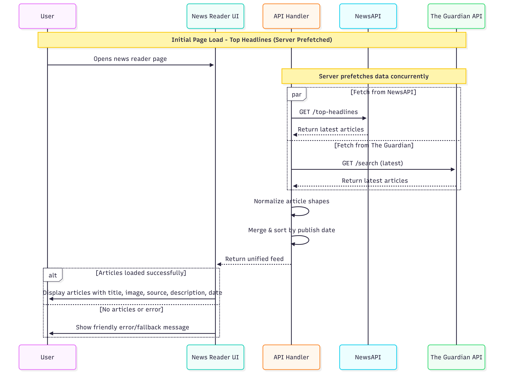
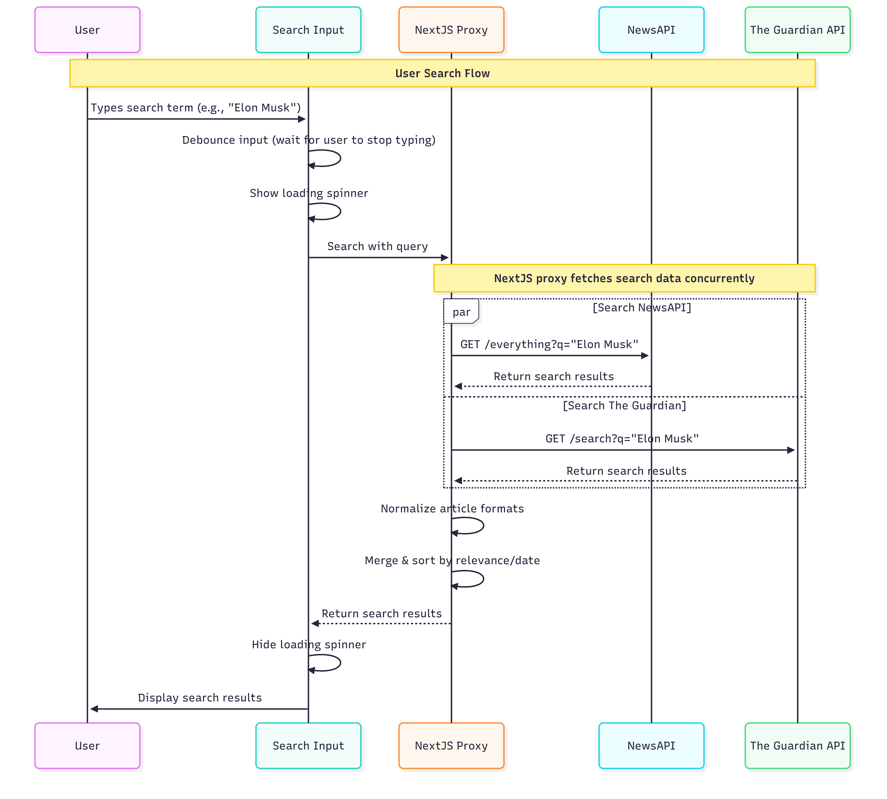

# 📰 Beyond Creation – News Aggregator

Beyond Creation is a modern **Next.js** web app that aggregates news from multiple sources like **NewsAPI** and **The Guardian**, giving users a unified feed of the latest headlines and real-time search capabilities.

---

## Documentation

### 🔗User Story: <a href="https://www.notion.so/Beyond-Creation-Task-News-Aggregator-23f7bf91b25b80129238d6724573054e" target="_blank">User Story Link</a>

### Sequence Diagrams

#### Initial Load



---

#### User Search Flow



---

## Tech Stack

- **Framework:** Next.js 14
- **Styling:** Tailwind CSS
- **Animation:** GSAP
- **Data Fetching:** `@tanstack/react-query`
- **API Sources:** [NewsAPI.org](https://newsapi.org) & [The Guardian Open Platform](https://open-platform.theguardian.com/)

---

## Installation & Setup

```bash
# 1. Clone the repo
git https://github.com/Amr097/News-Aggregator.git


# 2. Install dependencies
npm install

# 3. Add environment variables
touch .env.local

# Test API Keys
NEWS_API_KEY=b5e6f03148e749798ba6d6039411a020
GUARDIAN_API_KEY=2229aafb-48e2-40b5-86f1-f133b9b90073

# URLS
NEXT_PUBLIC_BASE_URL=http://localhost:3000
NEWSAPI_BASE_URL=https://newsapi.org/v2/
GUARDIAN_BASE_URL=https://content.guardianapis.com


# 4. Run the development server
npm run dev

```
